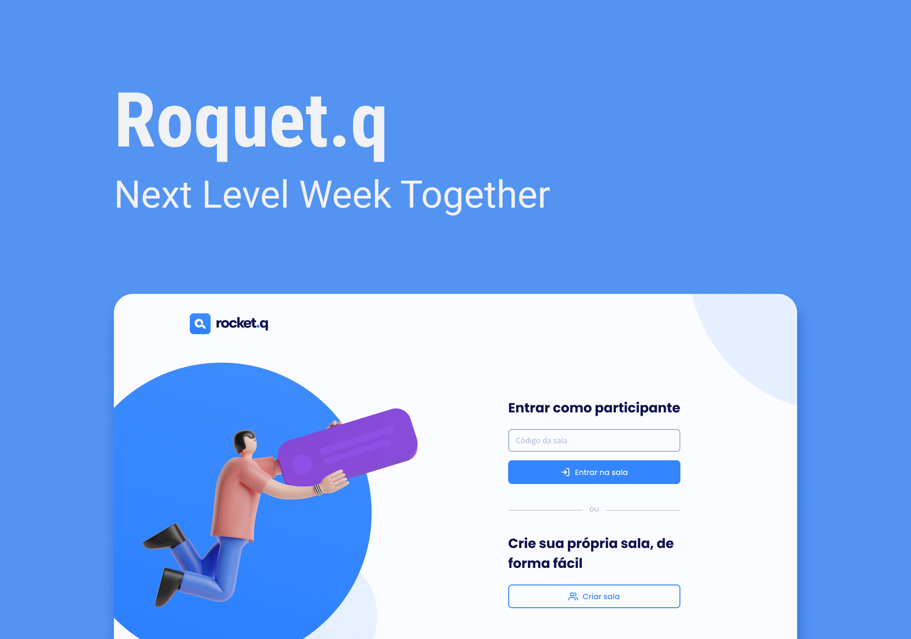

<h1 align="center">
  
</h1>

  <a href="#-technologies">Tecnologias</a>&nbsp;&nbsp;&nbsp;|&nbsp;&nbsp;&nbsp;
  <a href="#-project">Projeto</a>&nbsp;&nbsp;&nbsp;|&nbsp;&nbsp;&nbsp;
  <a href="#-layout">Layout</a>&nbsp;&nbsp;&nbsp;&nbsp;&nbsp;&nbsp;

 

  

## 🚀 Tecnologias

Esee projeto foi desenvolvido utilizando as tecnologias:

- HTML
- CSS
- JavaScript
- NodeJS
- EJS
- Express
- SQLite

## 💻 Projeto

Projeto criado no NLW (Next Lever Week) da Rocketseat.

Uma plataforma de perguntas e respostas com senhas de acesso para cada uma delas
e o administrador poderá excluir ou marcar a pergunta como lida.

## Como usar?

Baixe esse repositório e no terminal de sua máquina entre no diretório (pasta do arquivo), para então:

1. Digite o comando `npm install` e dê enter para instalar todas as dependências do projeto;
2. Feito isso, digite o comando `npm run init-db` e dê Enter para instalar o banco de dados;
3. E para rodar a alicação, digite o comando `npm start` e dê enter

## 🔖 Layout

Link para acessar o layout no figma [Link do projeto](https://www.figma.com/community/file/1009821158959690135).
